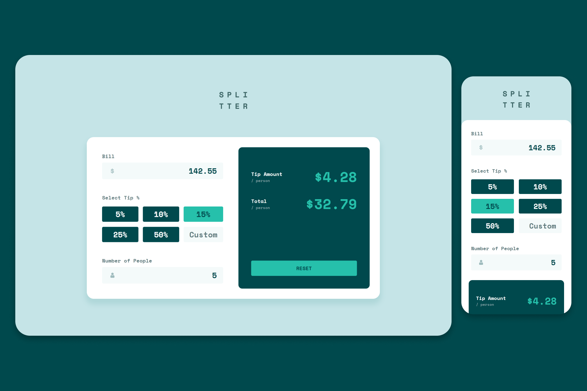

# Frontend Mentor - Tip calculator app

This is a solution to the [Tip calculator app challenge on Frontend Mentor](https://www.frontendmentor.io/challenges/tip-calculator-app-ugJNGbJUX).

<p align="center">
    
    
    
</p>

<h1 align="center">
    
</h1>

## 🎯 The challenge

Users should be able to:

- View the optimal layout for the app depending on their device's screen size
- See hover states for all interactive elements on the page
- Calculate the correct tip and total cost of the bill per person

## 🛠️ Built with

- HTML
- CSS
- Flexbox
- CSS Grid
- Mobile-first workflow
- JavaScript

## 🚀 How to clone

```bash
$ git clone https://github.com/pejamp/tip-calculator
$ cd tip-calculator
```

## 🌐 Project

- Solution URL: [Frontend Mentor](https://www.frontendmentor.io/solutions/responsive-layout-g0LMv2J_Td)
- Live Site URL: [Tip calculator](https://tip-calculator-ashen-alpha.vercel.app/)

## 👨‍💻 Author

<a href="https://github.com/pejamp">
 
 <br />
 <sub><b>Pedro Rodrigues</b></sub>
</a> 
<a href="https://github.com/pejamp"></a>
<br />

## Contact me!

[](https://www.linkedin.com/in/pedro-rodrigues-3a3647176/)
[](mailto:pedro.roguea@gmail.com)
